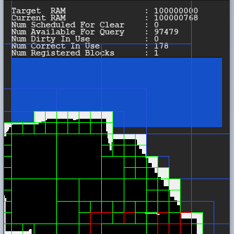
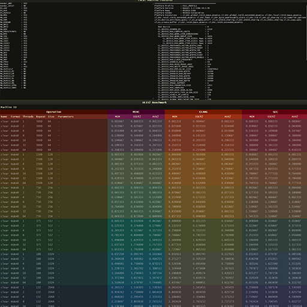
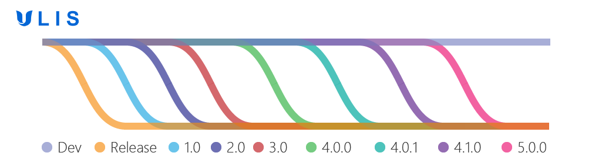

    

## Honor
Maxim Shemanarev is my hero, he did a great job.

## Overview
ULIS is a rendering library written in C++. It is aimed at software rasterization and digital image processing.

## Samples
 |  | 
---- | ---- | ----
 |  | 

## Worflow

    

## Links
- [Official Github Repository](https://github.com/Praxinos/ULIS)  
- [Author Webpage](http://clementberthaud.com/)  
- [Praxinos Website](https://praxinos.coop/)  

## License
Check LICENSE.md, ULIS is licensed under a commercial license and is NOT available for free.

## Documentation
Check the [documentation](https://praxinos.coop/Documentation/ULIS/Developer/version/dev/html/) for the API reference and details on the build process.  

