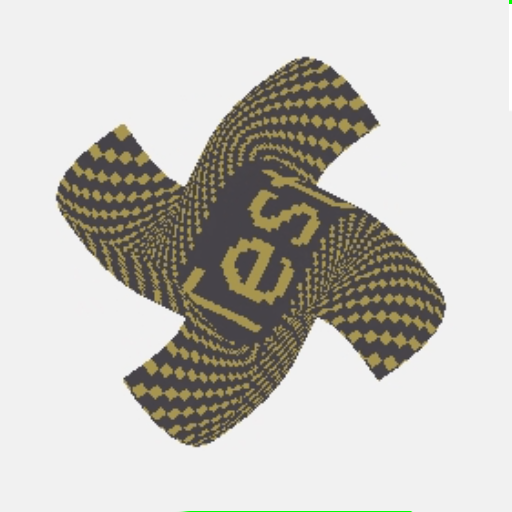

    

## Overview
ULIS is a graphics library written in C++. It is aimed at software rasterization and digital image processing.  

## Links
Official repository: https://github.com/Praxinos/ULIS  
Official home pages: https://praxinos.coop/ulis  
Official docs pages: https://praxinos.coop/ULIS/documentation/  
Official wasm demos: https://praxinos.coop/ULIS/demo/blend/  
Author web homepage: http://clementberthaud.com/  
Praxinos website: https://praxinos.coop/  

## Samples
 |  | 
---- | ---- | ----
 |  | 

## License
Check LICENSE.md, ULIS is NOT available for free.
|Name               |Link                                                           |License            |
|-------------------|---------------------------------------------------------------|-------------------|
|ULIS               |https://github.com/Praxinos/ULIS                               |Commercial         |

## Software Requirements

        Linux, Windows or MacOS
        CMake
        Git
        C++ compiler with support for C++14 or greater

## Dependencies
Dependencies are redistributed directly within the repository under the 3rdparty directory.

|Dependency         |Link                                                           |License            |Status                                             |
|-------------------|---------------------------------------------------------------|-------------------|---------------------------------------------------|
|clip               |https://github.com/dacap/clip                                  |MIT                |Keep for now                                       |
|cppfs              |https://github.com/cginternals/cppfs                           |MIT                |Remove when upgrading to C++17                     |
|eigen              |https://gitlab.com/libeigen/eigen                              |MPL2               |Remove and implement Mat8x8                        |
|FeatureDetector    |https://github.com/Mysticial/FeatureDetector                   |CC0 1.0 Universal  |Remove and implement custom device info fetching   |
|freetype2          |https://github.com/aseprite/freetype2                          |FTL ( BSD-like )   |Keep                                               |
|glm                |https://github.com/g-truc/glm                                  |MIT                |Remove and implement vec and mat types             |
|Little-CMS         |https://github.com/mm2/Little-CMS                              |MIT                |Keep                                               |
|OCL-SDK            |https://github.com/GPUOpen-LibrariesAndSDKs/OCL-SDK/releases   |-                  |No need to track as dependency especially for MacOS|
|static_math        |https://github.com/Morwenn/static_math                         |MIT                |Remove and implement basic static operations       |
|stb_image          |https://github.com/nothings/stb                                |MIT                |Keep for now                                       |
|stb_image_write    |https://github.com/nothings/stb                                |MIT                |Keep for now                                       |
|VCL                |https://github.com/vectorclass/version1                        |Apache 2.0         |Remove and implement raw SIMD calls                |

Additionaly, these libraries can be used with ULIS to test samples programs or build the python binding:

        Qt5.x
        Python3.x

## Bindings
ULIS officialy maintains a few bindings of the library. They are listed under the bindings/ directory. These bindings often have different build process than the library. Refer to the readme sections of the bindings for more details.

|Target                             |Name               |
|-----------------------------------|-------------------|
|Python                             |PyULIS3            |
|WebAssembly( wasm )                |wULIS3             |
|UnrealEngine4 ThirdParty Module    |ULIS               |

## Getting Started

        git clone https://github.com/Praxinos/ULIS
        mkdir ULIS3_Build
        cd ULIS3_Build
        cmake -G "YourGenerator" ../ULIS

Sample scripts are also available in the repository to help with the build process.
