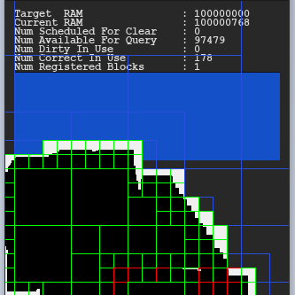
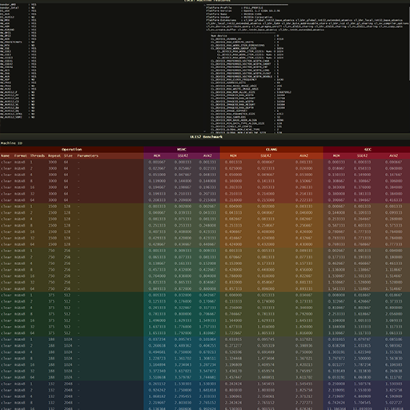

    

## Overview
ULIS is a graphics library written in C++. It is aimed at software rasterization and digital image processing, with scalable multiprocessor parallel programming, high performance with SIMD extensions, and hardware awareness in mind.  

## Samples
 |  | 
---- | ---- | ----
 |  | 

## Links
- [Official Repository](https://github.com/Praxinos/ULIS)  
- [Official Home Page](https://praxinos.coop/ulis)  
- [WASM Demo](https://praxinos.coop/ULIS/demo/blend/)  
- [Author Webpage](http://clementberthaud.com/)  
- [Praxinos Website](https://praxinos.coop/)  

## License
Check LICENSE.md, ULIS is licensed under a commercial license and is NOT available for free.

## Build
Check the [documentation](https://praxinos.coop/ULIS/documentation/) for details on the build process.  